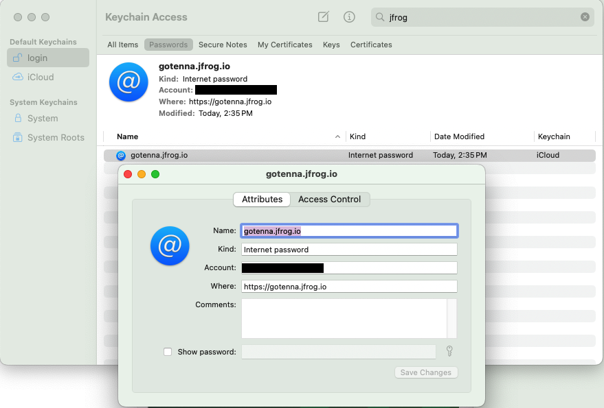

# goTenna Radio SDK for iOS

## Requirements
Make sure you've been given access to the RSDK on goTenna's JFrog/Artifactory instance. Also make sure you put those credentials in your macOS keychain:

## Installation
1. Right click your project > Add Package Dependencies... or go to the Package Dependencies section of your project and click the + button.
2. Paste https://github.com/gotenna/gotenna-rsdk-spm into the Package URL field.
3. Select the exact version you want from the Releases GitHub page (note if the version has a "v" as in v3.1.13, you would only put 3.1.13 in the version field for Swift Package Manager).

